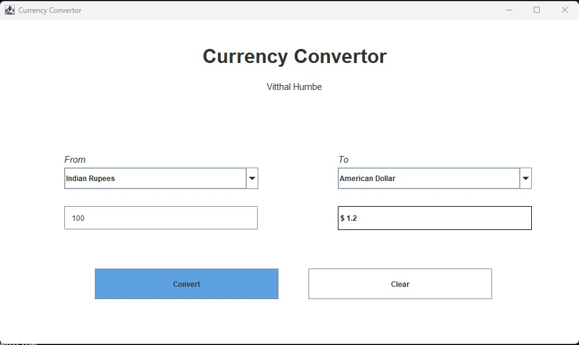

# Currency Converter README

This repository contains a simple currency converter implemented in Java using Swing for the graphical user interface. The application allows users to convert between Indian Rupees (INR), American Dollars (USD), Japanese Yen (JPY), and European Euros (EUR).

## Features

- **User-Friendly Interface:** The application provides a clean and intuitive user interface, allowing users to easily input values, select currencies, and perform conversions.

- **Multiple Currency Support:** Users can convert between Indian Rupees, American Dollars, Japanese Yen, and European Euros.

- **Conversion Accuracy:** The conversion rates are predefined and provide a basic level of accuracy for common currency conversions.

## Use and application
- Upon running the application, you will be presented with a graphical user interface.
- Select the "From" and "To" currencies from the dropdown lists.
- Enter the amount in the input field.
- Click the "Convert" button to perform the currency conversion.
- The result will be displayed in the output field.

## Output

## Contact 
- **Author** : Vitthal Humbe
- **E-mail**: [Send E-mail](vitthal.3454@gmail.com)
